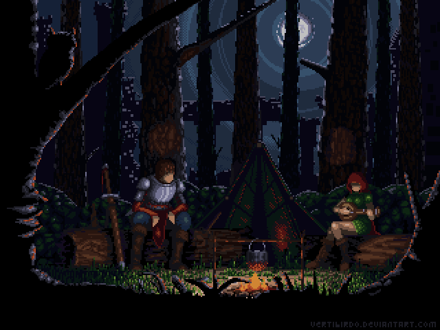

    
    <h2>Hello There 👋, welcome to my GitHub profile</h2>
     
    
I'm Alisson, a student of System Analysis and Development at 
        <a href="https://www.uninter.com/">International University Center Uninter</a> 
        in Rio Grande do Sul, Brazil.
         
        I’m currently learning Web Development with a focus on the Front-End side. I love
        learning new techs and tools, always striving and improving more and more, and i also love coffee, of course ☕😁.
    

     

    <a href="https://github.com/AlissonS47">
    
    

<h3>You can find me here:</h3>

 
     
    
    
  

<h3>Teck Stack:</h3>

 
    
    
    
    
    
    

